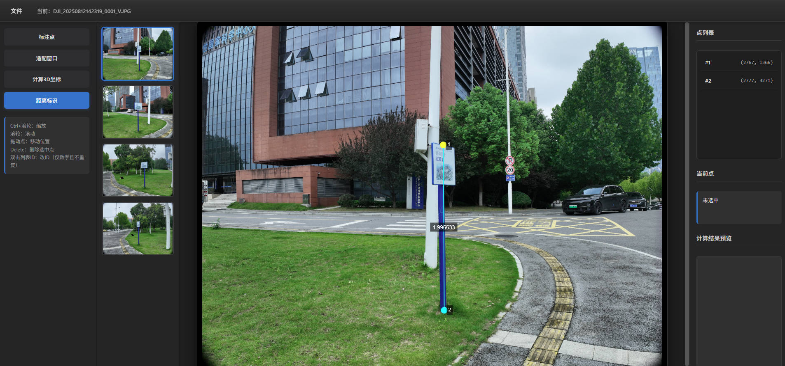
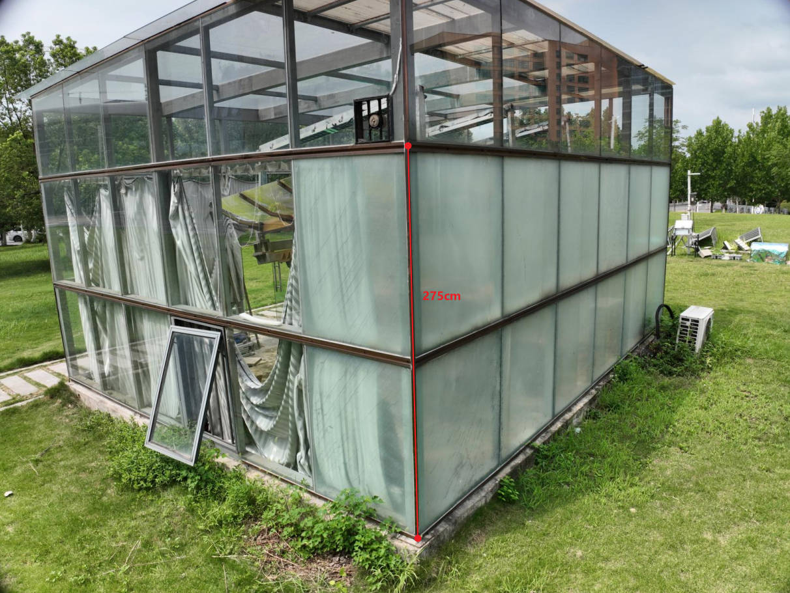
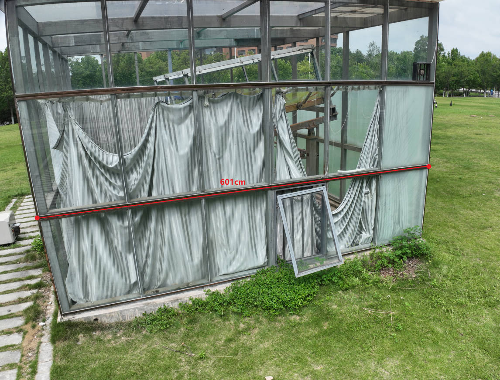
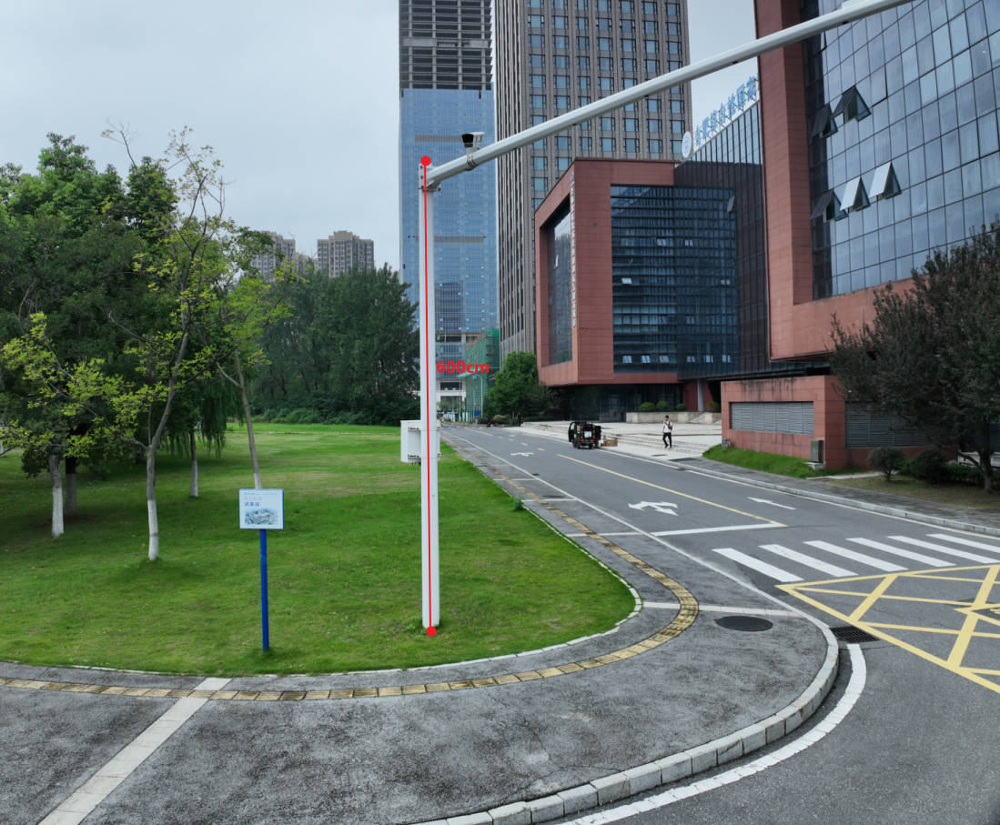
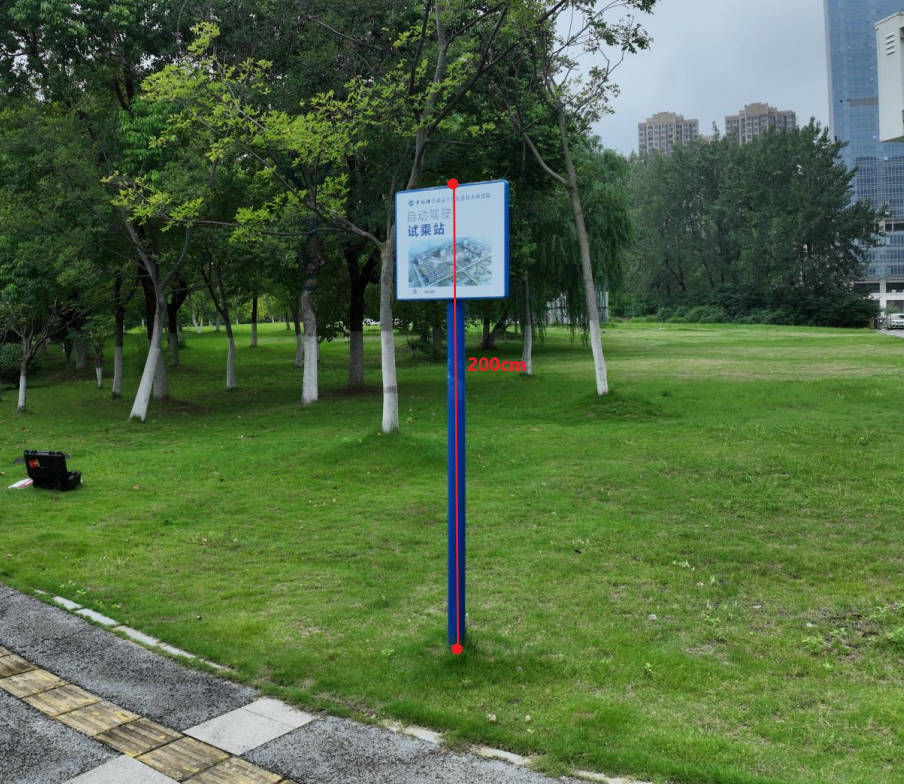

# Monocular Distance Measurement System
<p align="center">
   
</p>

[](./LICENSE)
[](https://www.python.org/)

[English README](./README-en.md) | [中文文档索引](./docs/zh/README.md)

`Monocular Multi-View Distance Measurement System (MMVDMS)` 是一个面向无人机多视角单目测距任务的开源实现。项目通过融合同一目标在多张单目图像中的重复观测与原始图像中携带的 RTK 级位姿元数据，恢复关键点 3D 坐标并计算空间距离。

项目适用于电力巡检、光伏场站复核、边坡与矿山巡查、建筑立面测量、工程测绘、灾情核查等需要基于原始无人机影像进行空间测量的业务场景。

当前仓库内置的 **DJI Mavic 3E** 样本集验证结果为：`25` 条样本、真值范围 `2.00m~6.01m`，汇总精度达到 **`MAE=0.084m`、`RMSE=0.126m`、平均相对误差 `2.120%`**。项目同时提供轻量 API 与统一点位格式，可扩展接入人工标注结果、关键点检测模型、视觉大模型或私有业务系统。

> **前提要求**：无人机拍摄时必须开启 `RTK`，并保留原始 JPEG 图像中的 EXIF/XMP 元数据。普通 GPS 的米级误差会显著破坏三角测距结果。



## 1. 项目能力
- 将同一目标在多视角下的 2D 关键点重建为 3D ECEF 坐标。
- 提供演示 App，覆盖导图、标注、三角测量、测距、导出全流程。
- 提供标定工具模块（`src/mvtriangulation/calibration`），支持张正友内参标定与鲁棒外参拟合。
- 支持解析 DJI JPEG 图像中的 XMP 元数据，自动提取经纬高、云台姿态与 RTK 相关字段。
- 提供统一 JSON/CSV/接口格式，便于扩展到关键点检测模型、行业算法或私有业务系统。

## 2. 仓库结构

```text
.
├── apps/
│   └── flask_demo/                    # Flask 演示应用
├── docs/
│   ├── en/
│   └── zh/
├── examples/
│   ├── demo_csv/                      # 示例点位数据
│   ├── demo_images/                   # 示例原图（含 XMP 元数据）
│   ├── minimal_usage.py               # 脚本示例：原图 + 点位 CSV -> 三角测量 + 点间距离
│   ├── fit_intrinsics_zhang.py        # 张正友内参标定示例
│   └── fit_extrinsics_robust.py       # 外参拟合示例
├── src/
│   └── mvtriangulation/
│       ├── calibration/
│       ├── parsers/
│       ├── pipeline.py
│       ├── transforms.py
│       └── triangulator.py
├── CONTRIBUTING.md
├── LICENSE
├── README.md
├── README-en.md
└── requirements.txt
```

## 3. 安装依赖

**环境要求：** Python >= 3.8

```bash
pip install -r requirements.txt
```

## 4. 快速开始

以下两种入口相互独立：**演示应用** 用于交互式操作，**完整示例** 用于脚本化处理；无需按顺序逐步执行。

### 4.1 演示应用
```bash
python -m apps.flask_demo
# 指定机型预设（可选）：M3E / M3T / others
python -m apps.flask_demo --camera-model M3T
```

浏览器访问：`http://localhost:5000`

### 4.2 完整示例（脚本方式）
```bash
python examples/minimal_usage.py \
  --points-csv examples/demo_csv/keypoints_observation2.csv \
  --image-dir examples/demo_images \
  --camera-model m3e \
  --pair 1-2
```

说明：
- `--points-csv` 仅提供点坐标，例如 `image,keypoint_id,x,y`。
- `--image-dir` 提供原始图像，脚本会自动从 XMP 中提取 `lat/lon/alt/gimbal_pitch/gimbal_yaw/gimbal_roll/gps_status/rtk_flag` 等字段。
- 脚本会将点坐标与原图元数据结合后进行三角测量，并输出每个点的 `_3d_position`（ECEF）以及点间距离。
- 可用机型参数：`m3e`（默认）、`m3t`、`others`。

## 5. 实践指导

### 5.1 图片采集前的准备

在开始采集前，建议先按下面清单逐项确认：

- **无人机准备**：必须开启 `RTK`，并确认飞行状态为可用的高精度定位解；若 RTK 未固定，测距结果通常不可用。
- **云台与镜头准备**：同一批次任务尽量使用同一镜头、同一分辨率、同一照片模式；避免数字变焦、裁切模式切换或中途更换镜头通道。
- **图像保真要求**：保留原始 JPEG，不要先经过二次压缩、社交软件转发或截图导出，否则可能丢失 XMP。
- **目标准备**：同一批图像中需要存在“同一个真实物理目标”的重复观测，后续才能建立同名关键点。
- **验证准备**：若需要验证精度，应提前准备卷尺、标杆、已知长度目标或地面控制点，用于记录真值。
- **环境准备**：尽量避免强反光、严重遮挡、极端逆光和大风抖动；这些因素会直接降低关键点定位质量。

### 5.2 默认机型快速接入

当前项目内置两组可直接启动的默认内参，均对应 **可见光广角通道**；使用默认参数时，应确保任务图像来自对应机型的**广角拍摄原图**。

| 机型（可见光广角） | 参考分辨率 | fx | fy | cx | cy | distortion_coefficients |
| --- | --- | ---: | ---: | ---: | ---: | --- |
| DJI Mavic 3E | 5280x3956 | 3660.0 | 3660.0 | 2640.0 | 1978.0 | [0, 0, 0, 0, 0] |
| DJI Mavic 3T | 8000x6000 | 5500.0 | 5500.0 | 4000.0 | 3000.0 | [0, 0, 0, 0, 0] |

使用建议：

- 以上参数适合作为初始化值或样机联调参数，不等价于实测标定结果。
- 若图像分辨率与上表不同，请按宽高比例同比缩放 `fx/fy/cx/cy`。
- 御 3T 默认指可见光广角通道，不包含热成像与长焦通道。
- 当任务进入稳定生产或精度要求较高时，仍建议执行 5.4 的内外参标定。

### 5.3 通过图片文本查看 XMP 元数据

如果使用 DJI 原始 JPEG，可以直接把图片用文本方式打开，搜索 `xmp`、`xmpmeta` 或 `drone-dji:`，快速检查拍摄时是否真正记录了 RTK、姿态和相机校准字段。

建议检查方式：

1. 用 VS Code、Notepad++ 或其他文本编辑器直接打开原始 `.JPG` 文件。
2. 搜索 `xmpmeta` 或 `drone-dji:`。
3. 重点核对 RTK、俯仰角、校准焦距、主点和畸变相关字段。

示例图 `examples/demo_images/DJI_20250812143439_0034_V.JPG` 中可直接检索到类似内容：

```xml
drone-dji:GpsStatus="RTK"
drone-dji:RtkFlag="50"
drone-dji:GimbalPitchDegree="+19.90"
drone-dji:DewarpData="2022-06-08;3713.290000000000,...,-0.027064110000"
drone-dji:CalibratedFocalLength="3725.151611"
drone-dji:CalibratedOpticalCenterX="2640.000000"
drone-dji:CalibratedOpticalCenterY="1978.000000"
```

这些字段的意义大致如下：

- `GpsStatus`、`RtkFlag`、`RtkStdLon/Lat/Hgt`：用于判断 RTK 是否启用、解算状态是否稳定。
- `GimbalPitchDegree`、`GimbalYawDegree`、`GimbalRollDegree`：云台姿态角，直接参与测距。
- `CalibratedFocalLength`、`CalibratedOpticalCenterX/Y`：可用于还原内参中的焦距与主点关键参数。
- `DewarpData`：包含去畸变/畸变相关参数，可作为镜头校准信息参考（出厂时自带，经过维修时可能丢失，需要重新通过大疆智图标定）。

当前代码默认可从原图中提取 `lat/lon/alt/gimbal_pitch/gimbal_yaw/gimbal_roll/gps_status/rtk_flag` 等字段；如需读取更多 XMP 字段，可扩展 `src/mvtriangulation/parsers/dji_xmp.py`。

### 5.4 其它机型的内外参标定

若使用的不是默认机型，或者虽然是默认机型但实际镜头、分辨率、通道、安装状态与预设不一致，则应执行完整的内外参标定。

推荐流程如下：

1. **先做内参标定**：使用同分辨率的棋盘格图片，覆盖不同距离、不同姿态、不同画面区域。
2. **再做外参拟合**：基于带真值的观测 CSV，拟合云台安装误差或固定偏置。
3. **最后做独立验证**：用未参与拟合的新样本验证精度，再投入生产任务。

内参标定（张正友法）：

```bash
python examples/fit_intrinsics_zhang.py \
  --images "data/calib/*.jpg" \
  --board-cols 9 \
  --board-rows 6 \
  --square-size 0.025 \
  --out "data/camera_intrinsics.json"
```

外参拟合（鲁棒最小二乘）：

```bash
python examples/fit_extrinsics_robust.py \
  --intrinsics "data/camera_intrinsics.json" \
  --fit-csv "data/obs_fit.csv" \
  --test-csv "data/obs_test.csv" \
  --out "data/camera_extrinsic_params.json" \
  --with-xyz-offset
```

标定时建议注意：

- 棋盘格图片必须与正式任务图像使用同一分辨率。
- 棋盘格需覆盖中心、四角、近距、远距、俯仰变化等不同工况。
- 外参拟合样本应覆盖不同基线、不同目标距离、不同拍摄方向。
- 对于非 DJI 机型，除了内外参标定，还需要自行补充元数据解析接口，或在输入表中显式提供位姿字段。

标定文档可直接参考：

- [中文标定说明](./docs/zh/calibration.md)

### 5.5 满足“同一目标多视角”的拍摄方法

要让单目多视角测距成立，拍摄时必须满足“同一个物理目标在至少两张图像中被稳定观测”的基本条件。建议按下面方式采集：

- **同一目标至少 2 个视角**：可用下限是 2 张，实际建议 `3~6` 张，以提高稳定性并便于剔除异常视角。
- **必须产生真实基线**：不要只在原地只旋转云台，最好让无人机位置发生横向或斜向变化，形成有效相机中心位移。
- **同名关键点保持一致**：例如塔脚、螺栓、组件角点、边角特征等，在不同图像中要标成同一个 `keypoint_id`。
- **控制基线与目标距离关系**：当前样本任务设定的典型作业范围是基线 `0.5m~2m`、目标距离 `3m~15m`；更远目标通常需要更大的有效基线，但要确保目标仍清晰可见。
- **保证目标完整可见**：尽量避免关键点在某些图像中被遮挡、裁切或严重模糊。
- **控制拍摄质量**：尽量降低拖影、过曝、欠曝和高 ISO 噪声；必要时提高快门或降低飞行速度。
- **保持原始元数据**：拍摄后直接使用原图进入流程，避免经由截图、导出或图片压缩工具再保存。

### 5.6 数据准备与执行方式

#### 5.6.1 使用演示 App

演示应用适用于交互式处理和人工复核场景，推荐步骤如下：

1. 启动应用并上传原始图像；图像必须保留原始 XMP 元数据。
2. 在多张图像上为同一物理目标标注一致的 `keypoint_id`。
3. 通过界面加载默认机型参数，或上传自标定得到的内外参 JSON。
4. 点击 **计算 3D**，系统会自动读取原图 XMP 元数据并完成三角测量。
5. 进入测距模式选择点对，按需导出 CSV、JSON 或叠加图。

如果关键点来自模型而不是人工标注，可通过现有接口回填：

- `POST /api/annotations/<image_id>`：写入关键点
- `POST /api/compute/3d`：计算 3D 结果
- `GET /api/export/csv`：导出点位结果

#### 5.6.2 使用脚本方式

脚本方式适用于批处理、模型联调和私有化集成场景。推荐输入组织方式如下：

1. 保留一份原始图像目录，目录中的图片必须是带 XMP 的原图。
2. 使用标注工具输出关键点 JSON，或使用大模型/关键点检测模型直接输出像素坐标。
3. 将点位结果整理为规定的输入格式或者用CSV作为中间方式保存，至少包含 `image,keypoint_id,x,y` 四列；`image` 应与原图文件名或可解析路径对应。
4. 运行脚本，传入点位 CSV 与原图目录。
5. 脚本会从原图中自动提取 `lat/lon/alt/gimbal_pitch/gimbal_yaw/gimbal_roll/gps_status/rtk_flag` 等字段，并与 CSV 中的点坐标合并后完成三角测量。

推荐的点位 CSV 结构如下：

```csv
image,keypoint_id,x,y,true_length
DJI_20250812143439_0034_V.JPG,1,2627.11,1558.45,6
DJI_20250812143439_0034_V.JPG,2,2597.85,3372.28,6
```

执行命令示例：

```bash
python examples/minimal_usage.py \
  --points-csv examples/demo_csv/keypoints_observation2.csv \
  --image-dir examples/demo_images \
  --camera-model m3e \
  --pair 1-2
```

## 6. 我方实拍案例

### 6.1 拍摄条件

当前仓库提供了一组已验证的实拍样本，工况如下：

- 机型：DJI Mavic 3E（可见光广角）
- 图像来源：`examples/demo_images/` 与 `examples/demo_csv/keypoints_observation2.csv`
- 目标物数量：4 个观测点（README 中统计指标对应完整样本集）
- 当前示例脚本点位：2 个观测点（ID 1~2）
- 样本数：25
- 真值范围：`2.00m~6.01m`
- 任务设定的目标距离范围：`3m~15m`
- 任务设定的基线范围：`0.5m~2m`

### 6.2 拍摄结果示例

下图为当前样本中的部分观测目标：

| ID_0 | ID_1 | ID_2 | ID_3 |
| --- | --- | --- | --- |
|  |  |  |  |

## 7. 样本集指标与验证结果

### 7.1 指标定义

符号约定：$d_i^{gt}$ 为第 $i$ 条样本真值距离，$d_i^{pred}$ 为预测距离，$N$ 为样本总数。

| 指标 | 数学定义 | 解释 |
| --- | --- | --- |
| `AE` | $AE_i = \left\lvert d_i^{pred} - d_i^{gt} \right\rvert$ | 单样本绝对误差，单位 m。 |
| `RE` | $RE_i = \frac{\left\lvert d_i^{pred} - d_i^{gt} \right\rvert}{d_i^{gt}} \times 100\%$ | 单样本相对误差，单位 %。 |
| `MAE` | $\mathrm{MAE} = \frac{1}{N}\sum_{i=1}^{N} \left\lvert d_i^{pred} - d_i^{gt} \right\rvert$ | 全样本绝对误差均值，反映整体平均偏差。 |
| `RMSE` | $\mathrm{RMSE} = \sqrt{\frac{1}{N}\sum_{i=1}^{N}\left(d_i^{pred} - d_i^{gt}\right)^2}$ | 全样本均方根误差，对大误差更敏感。 |
| `Bias` | $\mathrm{Bias} = \frac{1}{N}\sum_{i=1}^{N}\left(d_i^{pred} - d_i^{gt}\right)$ | 全样本有符号误差均值；正值偏高估，负值偏低估。 |

### 7.2 汇总结果

| 机型 | 样本数 N | MAE(m) | RMSE(m) | 平均 RE(%) | Bias(m) |
| --- | ---: | ---: | ---: | ---: | ---: |
| DJI Mavic 3E | 25 | 0.084 | 0.126 | 2.120 | +0.052 |

补充统计：

- 最小 `AE=0.0002m`
- 最大 `AE=0.363m`
- 最小 `RE=0.0058%`
- 最大 `RE=6.053%`

### 7.3 分目标结果

| 观测点 ID | 样本数 N | MAE(m) | RMSE(m) | 平均 RE(%) | Bias(m) |
| --- | ---: | ---: | ---: | ---: | ---: |
| 0 | 13 | 0.024 | 0.032 | 0.879 | -0.012 |
| 1 | 3 | 0.158 | 0.176 | 2.628 | +0.068 |
| 2 | 4 | 0.240 | 0.257 | 4.006 | +0.240 |
| 3 | 5 | 0.071 | 0.075 | 3.533 | +0.060 |

### 7.4 样本明细

| 序号 | 观测点 ID | 真值(m) | 预测值(m) | RE(%) | 最大基线(m) | 最小基线(m) |
| ---: | ---: | ---: | ---: | ---: | ---: | ---: |
| 1 | 0 | 2.75 | 2.725 | 0.918 | 2.674 | 2.108 |
| 2 | 0 | 2.75 | 2.744 | 0.210 | 7.358 | 1.983 |
| 3 | 0 | 2.75 | 2.711 | 1.424 | 3.027 | 1.370 |
| 4 | 0 | 2.75 | 2.716 | 1.242 | 2.995 | 2.150 |
| 5 | 0 | 2.75 | 2.738 | 0.431 | 3.230 | 2.066 |
| 6 | 0 | 2.75 | 2.759 | 0.313 | 2.848 | 2.615 |
| 7 | 0 | 2.75 | 2.815 | 2.355 | 9.904 | 2.672 |
| 8 | 0 | 2.75 | 2.753 | 0.107 | 7.051 | 0.450 |
| 9 | 0 | 2.75 | 2.734 | 0.570 | 6.118 | 4.906 |
| 10 | 0 | 2.75 | 2.708 | 1.525 | 5.195 | 4.102 |
| 11 | 0 | 2.75 | 2.690 | 2.181 | 5.941 | 2.291 |
| 12 | 0 | 2.75 | 2.746 | 0.137 | 3.920 | 3.289 |
| 13 | 0 | 2.75 | 2.750 | 0.006 | 2.149 | 1.355 |
| 14 | 1 | 6.01 | 6.085 | 1.240 | 3.925 | 2.592 |
| 15 | 1 | 6.01 | 6.274 | 4.387 | 6.108 | 4.182 |
| 16 | 1 | 6.01 | 5.874 | 2.256 | 0.254 | 0.136 |
| 17 | 2 | 6.00 | 6.363 | 6.053 | 5.244 | 3.529 |
| 18 | 2 | 6.00 | 6.283 | 4.722 | 4.982 | 3.570 |
| 19 | 2 | 6.00 | 6.193 | 3.210 | 4.344 | 3.710 |
| 20 | 2 | 6.00 | 6.122 | 2.037 | 4.220 | 3.647 |
| 21 | 3 | 2.00 | 2.063 | 3.134 | 3.385 | 0.487 |
| 22 | 3 | 2.00 | 2.072 | 3.584 | 3.594 | 0.053 |
| 23 | 3 | 2.00 | 1.973 | 1.346 | 3.777 | 2.325 |
| 24 | 3 | 2.00 | 2.107 | 5.372 | 2.999 | 0.734 |
| 25 | 3 | 2.00 | 2.085 | 4.231 | 4.060 | 1.134 |

## 8. 扩展接入与参考文档

### 8.1 接入关键点检测模型

项目当前的测距核心并不绑定某一种点位来源，只要能提供统一的关键点格式，就可以接入第三方模型。推荐两种方式：

1. **通过演示 App 接口回填点位**
2. **在离线脚本中使用原图目录 + 点位 CSV 批量计算**

演示 App 中，每张图像的标注点格式为：

```json
{
  "points": [
    { "keypoint_id": 0, "x": 1234.5, "y": 987.6 },
    { "keypoint_id": 1, "x": 1420.2, "y": 1050.8 }
  ],
  "meta": {
    "source": "detector"
  }
}
```

可直接调用：

- `POST /api/annotations/<image_id>`：写入关键点
- `POST /api/compute/3d`：计算 3D 结果
- `GET /api/export/csv`：导出点位结果

若走脚本方式，建议将标注工具 JSON、大模型输出或关键点检测模型输出统一整理为如下字段：

- `image`
- `keypoint_id`
- `x`
- `y`

脚本会负责从原图中提取位姿与 RTK 元数据，并将两部分信息自动合并。

### 8.2 核心 API

核心包路径：`src/mvtriangulation`

三角测量：

- `mvtriangulation.CameraTriangulator`
- `mvtriangulation.triangulate_dataframe`
- `mvtriangulation.build_camera_arrays`

标定：

- `mvtriangulation.ZhangIntrinsicsConfig`
- `mvtriangulation.calibrate_intrinsics_zhang`
- `mvtriangulation.ExtrinsicFitConfig`
- `mvtriangulation.fit_extrinsics`

元数据解析：

- `mvtriangulation.extract_dji_metadata_from_jpeg_bytes`

### 8.3 文档入口

- 架构说明：[docs/zh/architecture.md](./docs/zh/architecture.md)
- 演示 App 使用说明：[docs/zh/app-user-guide.md](./docs/zh/app-user-guide.md)
- 标定说明：[docs/zh/calibration.md](./docs/zh/calibration.md)
- 单目测距原理：[docs/zh/monocular-distance-principle.md](./docs/zh/monocular-distance-principle.md)

## 9. 约束说明

- **无人机须开启 RTK 定位**：算法依赖厘米级精度的位置与姿态数据，普通 GPS（米级精度）会导致三角测量结果不可用。
- **当前默认支持 DJI 无人机元数据格式**：位姿信息通过解析 DJI JPEG 图像的 EXIF/XMP 元数据获取；其他厂商机型需自行实现元数据解析接口。
- 当前演示应用为内存存储，重启后数据清空。
- 每个关键点至少需要两条有效观测。
- 测距精度对标定质量和基线几何高度敏感。

## 10. 关于我们

合肥中科类脑智能技术有限公司成立于2017年9月，是一家专注于类脑智能技术研发与产业化应用的国家级专精特新“小巨人”企业。公司依托类脑智能技术及应用国家工程实验室等重大科研平台，是实验室迄今唯一技术成果转化单位。公司以“推动前沿智能技术落地，助力产业数智升级”为使命，持续促进人工智能与实体经济深度融合。

公司核心业务涵盖算力、电力及算电碳协同等领域，主要产品包括：

1. 类脑异构计算系统，提供异构算力统一调度与AI任务优化服务；
2. 类脑多模态大模型，服务电网设备健康诊断、配网缺陷识别与新能源智慧运维等，全面覆盖发、输、变、配、用等环节；
3. 算电碳协同智慧系统，实现算力与电力资源的动态匹配与优化调度，并拓展虚拟电厂运营与AI电力交易服务。

目前，中科类脑已为多家能源企业、高校及科研机构提供关键技术服务，累计落地项目超过1000项。其智慧能源解决方案助力全国二十四省份的变电站、风电场和光伏电站实现高效运行与“少人/无人化”运维。由公司牵头建设的皖疆人工智能科技产业园，正在积极促进东西部协作与算力基础设施融合发展。

中科类脑，致力于成为全球领先的能源智能服务企业，致力于成为全球AI生态建设者。

商务合作：`business@leinao.ai`  
媒体合作：`media@leinao.ai`  
加入我们：`HR@leinao.ai`

## 11. 许可证与贡献

- 许可证：见 [LICENSE](./LICENSE)
- 贡献指南：见 [CONTRIBUTING.md](./CONTRIBUTING.md)


