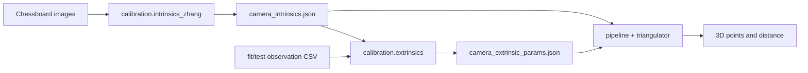
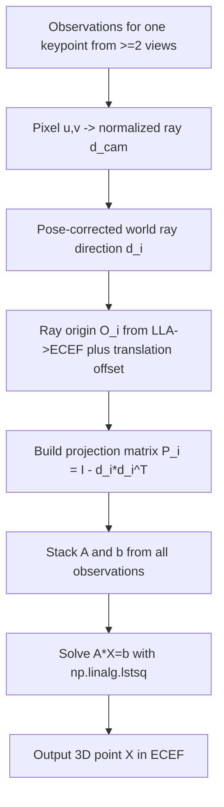

# Algorithm Architecture

This document focuses on the core algorithm package under `src/mvtriangulation`.

## 1. Scope and Boundary
- In scope: camera model, coordinate transforms, metadata parsing, input normalization, calibration, and multi-view triangulation.
- Out of scope: HTTP routing, UI interaction, persistence implementation.

The demo app calls this package through `compute3d_service`, but the package itself is framework-independent.

## 2. Package Structure

```text
src/mvtriangulation/
├── __init__.py
├── exceptions.py
├── models.py
├── pipeline.py
├── transforms.py
├── triangulator.py
├── calibration/
│   ├── __init__.py
│   ├── intrinsics_zhang.py
│   └── extrinsics.py
└── parsers/
    ├── __init__.py
    └── dji_xmp.py
```

## 3. Module Responsibilities

| Module | Responsibility | Key APIs |
|---|---|---|
| `__init__.py` | Stable public export surface | `CameraTriangulator`, `triangulate_dataframe`, calibration APIs |
| `exceptions.py` | Domain-level errors | `TriangulationError`, `InputSchemaError` |
| `models.py` | Data contracts for camera/observation structures | `CameraIntrinsics`, `CameraExtrinsics`, `Observation` |
| `pipeline.py` | Input normalization + high-level orchestration | `build_camera_arrays`, `triangulate_dataframe`, `detect` |
| `transforms.py` | Coordinate and rotation math | `lla_to_ecef`, `body_to_ned_matrix`, `ned_to_ecef_matrix`, `cam_ray_to_ecef` |
| `triangulator.py` | Core geometric solver | `CameraTriangulator.get_3d_results` |
| `calibration/intrinsics_zhang.py` | Chessboard-based intrinsics calibration | `ZhangIntrinsicsConfig`, `calibrate_intrinsics_zhang` |
| `calibration/extrinsics.py` | Robust fixed extrinsics fitting | `ExtrinsicFitConfig`, `fit_extrinsics`, `calibrate_and_save` |
| `parsers/dji_xmp.py` | DJI XMP metadata extraction from image bytes | `extract_dji_metadata_from_jpeg_bytes` |

## 4. End-to-End Triangulation Flow

```mermaid
flowchart LR
    A[Observations DataFrame] --> B[pipeline.build_camera_arrays]
    B --> C[pipeline.triangulate_dataframe]
    C --> D[CameraTriangulator.get_3d_results]
    D --> E[Schema check + numeric coercion]
    E --> F[Group by keypoint_id]
    F --> G[_backproject_ray via cv2.undistortPoints]
    G --> H[transforms.cam_ray_to_ecef]
    H --> I[_triangulate_point least squares]
    I --> J[_3d_position in ECEF]
```



## 5. Calibration Flow



## 6. Triangulation Core (Per Keypoint)



## 7. Design Notes
- `pipeline.py` is the recommended entry when integrating the algorithm into other systems.
- Calibration modules are reusable utilities and not tied to the demo app.
- `triangulator.py` should remain numerically stable and side-effect free.
- `transforms.py` isolates coordinate-frame assumptions for auditable convention changes.
