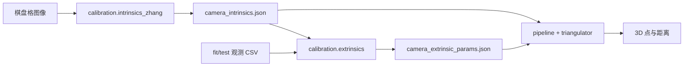
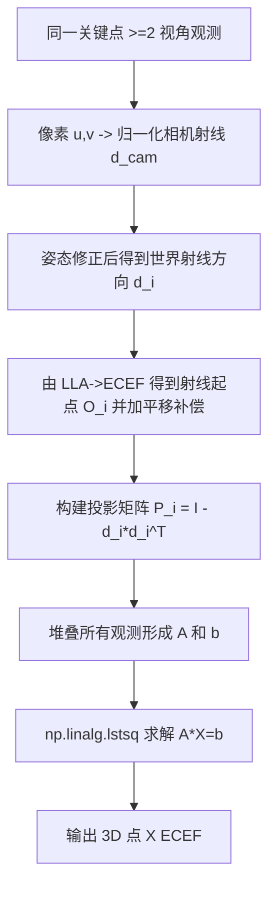

# 算法架构说明

本文重点描述 `src/mvtriangulation` 核心算法模块。

## 1. 范围与边界
- 范围内：相机模型、坐标变换、元数据解析、输入归一化、标定与多视角三角测量。
- 范围外：HTTP 路由、前端交互、持久化实现。

演示 App 通过 `compute3d_service` 调用该包，但算法包本身不依赖 Web 框架。

## 2. 包结构

```text
src/mvtriangulation/
├── __init__.py
├── exceptions.py
├── models.py
├── pipeline.py
├── transforms.py
├── triangulator.py
├── calibration/
│   ├── __init__.py
│   ├── intrinsics_zhang.py
│   └── extrinsics.py
└── parsers/
    ├── __init__.py
    └── dji_xmp.py
```

## 3. 模块职责

| 模块 | 作用 | 关键接口 |
|---|---|---|
| `__init__.py` | 对外稳定导出入口 | `CameraTriangulator`、`triangulate_dataframe`、标定接口 |
| `exceptions.py` | 算法域错误定义 | `TriangulationError`、`InputSchemaError` |
| `models.py` | 相机参数与观测数据结构约定 | `CameraIntrinsics`、`CameraExtrinsics`、`Observation` |
| `pipeline.py` | 输入标准化与高层调度 | `build_camera_arrays`、`triangulate_dataframe`、`detect` |
| `transforms.py` | 坐标系与旋转矩阵计算 | `lla_to_ecef`、`body_to_ned_matrix`、`ned_to_ecef_matrix`、`cam_ray_to_ecef` |
| `triangulator.py` | 核心几何求解器 | `CameraTriangulator.get_3d_results` |
| `calibration/intrinsics_zhang.py` | 棋盘格内参标定 | `ZhangIntrinsicsConfig`、`calibrate_intrinsics_zhang` |
| `calibration/extrinsics.py` | 固定安装误差鲁棒拟合 | `ExtrinsicFitConfig`、`fit_extrinsics`、`calibrate_and_save` |
| `parsers/dji_xmp.py` | 从图像字节提取 DJI XMP 元数据 | `extract_dji_metadata_from_jpeg_bytes` |

## 4. 端到端三角测量流程

```mermaid
flowchart LR
    A[观测 DataFrame] --> B[pipeline.build_camera_arrays]
    B --> C[pipeline.triangulate_dataframe]
    C --> D[CameraTriangulator.get_3d_results]
    D --> E[字段校验与数值化]
    E --> F[按 keypoint_id 分组]
    F --> G[_backproject_ray 去畸变反投影]
    G --> H[transforms.cam_ray_to_ecef]
    H --> I[_triangulate_point 最小二乘]
    I --> J[ECEF 坐标 _3d_position]
```



## 5. 标定流程



## 6. 三角测量核心流程（单关键点）



## 7. 设计要点
- 对外集成优先使用 `pipeline.py`，避免直接依赖内部求解细节。
- 标定模块为可复用工具，不依赖演示 App。
- `triangulator.py` 仅做数值求解，保持无副作用和可测试性。
- `transforms.py` 集中管理坐标系约定，便于后续替换和审计。
